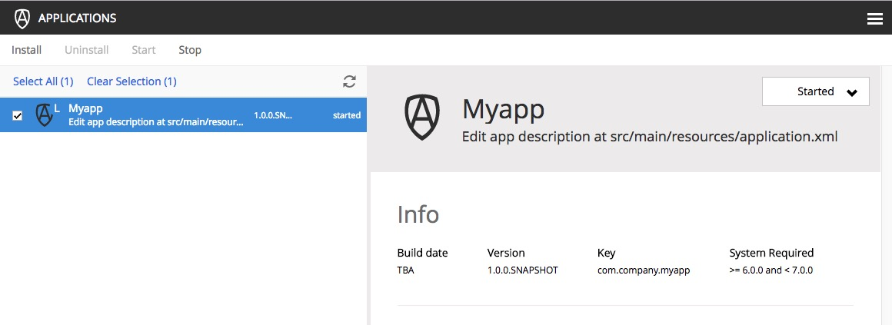
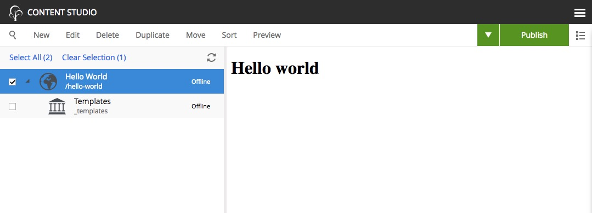
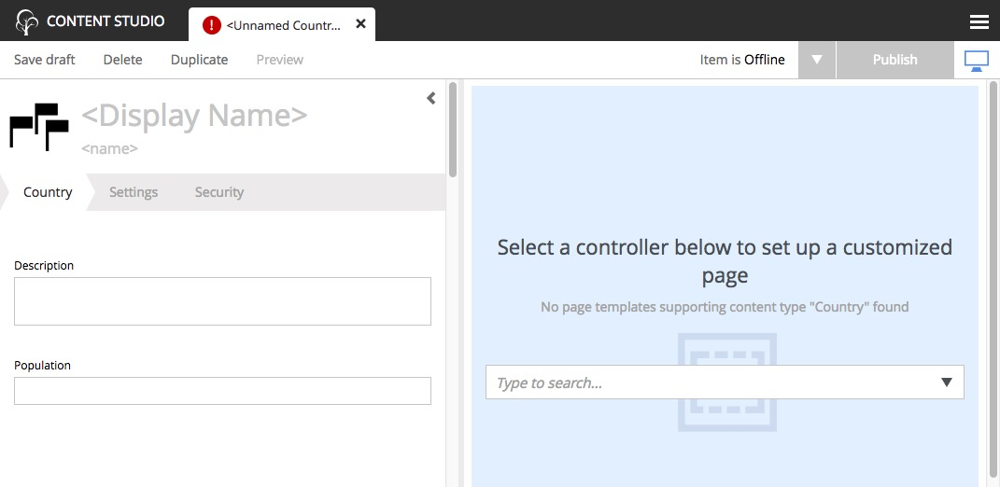
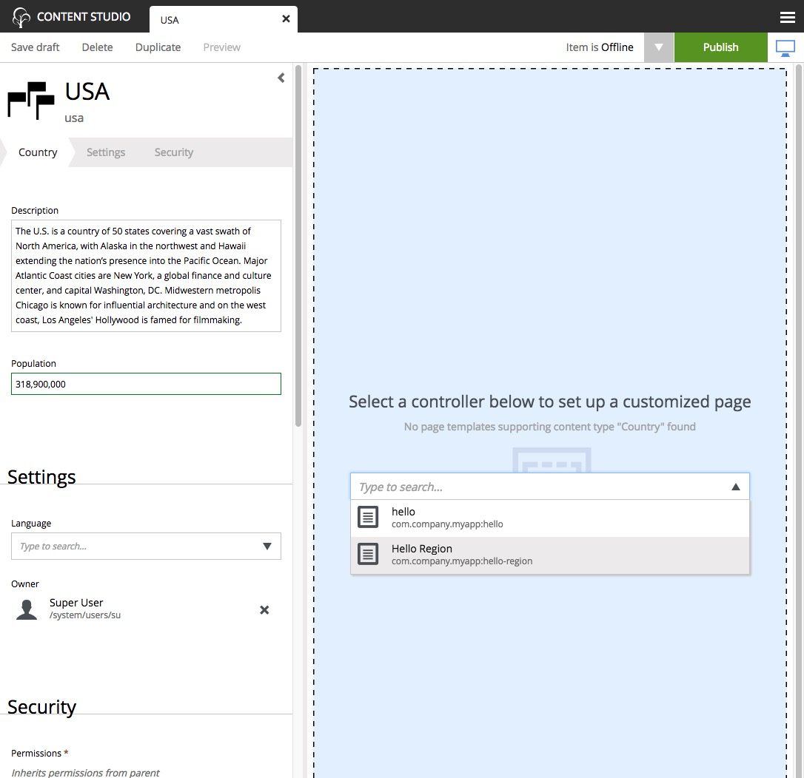
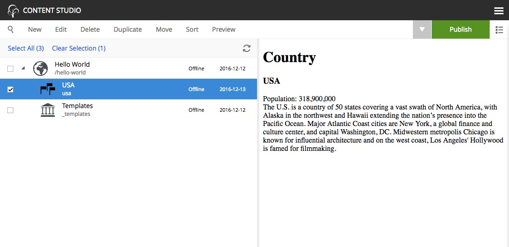
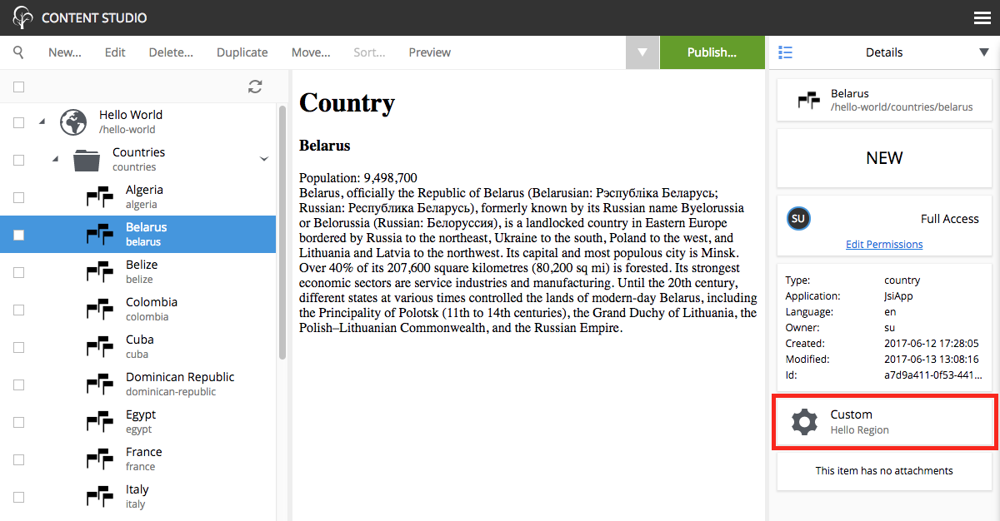
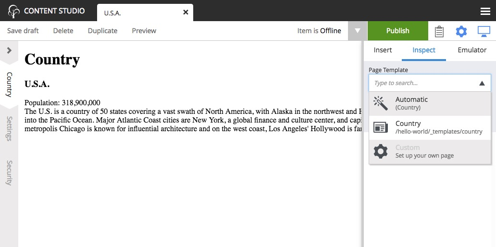

= Your first Enonic Website

*A step-by-step tutorial for building your first Website on the Enonic platform*

image::images/ready-set-code.svg["Ready...Set...Code!", width=100%]

****
[CAUTION]
====
In order to complete this tutorial, the Enonic development environment must be installed on your computer:
https://developer.enonic.com/enonic-101/install-developer-environment
====
****

= Part 1: Project set up

In this first section, you will learn how to initialize a new project with the CLI toolbox that comes with *Enonic XP*. Then you will build and deploy the app with Gradle. Next you will create a couple of files for your first page component. Finally, you’ll create a site with your app in the Content Studio.

== Initialize project

*Enonic XP* includes the http://docs.enonic.com/en/stable/reference/toolbox/index.html#toolbox[Toolbox CLI] which can perform several useful operations.
The http://docs.enonic.com/en/stable/reference/toolbox/init-project.html#init-project[init-project] operation will clone an existing project from a repository
source, such as https://github.com/[GitHub]. The https://market.enonic.com/vendors/enonic/vanilla-starter[starter-vanilla] project will initialize a new application
with the standard structures required (see http://docs.enonic.com/en/stable/developer/projects/index.html#projects[Projects]).

. *Create a new folder* at a suitable location on your filesystem for the application project files. e.g. `/Users/<username>/projects/myapp`. This will be the project root.
. *Change directory* in the terminal to this project root.

 cd /Users/<username>/projects/myapp

. *Run the following command*, replacing `[$XP_INSTALL]` with the path to your unzipped XP installation:

 [$XP_INSTALL]/toolbox/toolbox.sh init-project -n com.company.myapp -r starter-vanilla -c v1.3.0

For example, if your XP installation is at `/Users/enonic/installs/enonic-xp-${release}` then you would enter:

 /Users/enonic/installs/enonic-xp-${release}/toolbox/toolbox.sh init-project -n com.company.myapp -r starter-vanilla -c v1.3.0

NOTE: Only basic characters (a-z, 0-9 and .) may be used for application names, and the name must be globally unique. We recommend following
  standard Java package naming conventions such as com.mycompany.myapp.

*Your project folder will now be filled with the standard folder structure for developing an app.*

== Build and Deploy

Now that the basic project structure is set up, we should test that it builds and deploys successfully. But before deploying the app, the
`$XP_HOME` environment variable must be set to the path of the home folder of the XP installation.

. *Run the following command* in the terminal, replacing `[$XP_INSTALL]` with your installation location (no brackets):

:: *Linux and OSX:*

  export XP_HOME=[$XP_INSTALL]/home

:: For example, if your XP installation is at `/Users/enonic/installs/enonic-xp-${release}` then you would enter:

  export XP_HOME=/Users/enonic/installs/enonic-xp-${release}/home

:: *Windows*:

  set XP_HOME=[$XP_INSTALL]/home

. *Execute the following command* (from the project root directory):

:: *Linux and OSX:*

  ./gradlew deploy

:: *Windows:*

  gradlew deploy

:: The included http://gradle.org>[Gradle wrapper] will build the app and then attempt to deploy it to your installation.

:: The deployment step simply moves the result of the build (the application JAR file) into the `$XP_HOME/deploy` directory.
From there, *Enonic XP* will detect, install and start the application automatically.

:: You will need to access the Administrative console to check that the app has installed and started. *Enonic XP* must be running to proceed.

. Log in to the http://localhost:8080[Administrative console] with the Administrative user credentials. (The default credentials are
userid: *su* and password: *password*).

. Navigate to the *Applications Tool*. The application you just deployed should be listed here.

. Click the app called "_Myapp_" to see information about it and confirm that it has started.

NOTE: You can change the display name of the application by editing the gradle.properties file.

== Create the "_Hello World_" Site

Our next goal is to set up a "_Hello World_" site in *Content Studio*, but first we must add some initial configuration to our project.

=== Site descriptor

An application can serve many purposes and building sites is just one of them. The `site.xml` file is the descriptor that will let *Enonic
XP* know that this app can be added to a site. Response filters and controller mappings can be set up in the site descriptor as well as
application configurations (see http://docs.enonic.com/en/stable/developer/site/site.html#site-descriptor[Site descriptors]).

A basic `site.xml` file was automatically created by the `init-project` script and we don't need to make any changes for now. Later in this
tutorial we will edit `site.xml` to add a site-wide configuration.

  [project-root]/src/main/resources/site/site.xml

=== Application description and icon

The `application.xml` file at `[project-root]/src/main/resources/application.xml` can be edited to provide a suitable description for
your app. Go ahead and give your app a custom description.

The `application.svg` file can be replaced with a custom app icon. The description and icon will be visible in the admin tools.

NOTE: Most of the files we will be working with are inside the "site" directory in the project folder - `src/main/resources/site. All file
  paths from now on will begin with `site/`.

=== Page Component

Page components are the most basic building blocks of websites in *Enonic XP* (see http://docs.enonic.com/en/stable/developer/site/page/index.html#page[Page]). They require a JavaScript
controller and optionally an XML descriptor and an HTML view. This first example does not need a descriptor file.

A page controller (see http://docs.enonic.com/en/stable/developer/site/page/index.html#page[Page]) is a JavaScript file that handles requests such as *GET* and *POST*.
Controllers usually pass data in the form of a JavaScript object to be dynamically rendered in an HTML view. No data is passed in the
example below, but the view file is specified and rendered as static HTML.

. Create a folder called `hello` inside the `site/pages` directory.

. Create the page controller and page view files specified below inside the `hello` folder:
+
[source,javascript]
----
include::../src/main/resources/site/pages/hello/hello.js[]
----
+

The `view`  below is a simple HTML file. This file will be updated later to handle dynamic content.

+
[source,HTML]
----
include::../src/main/resources/site/pages/hello/hello.html[]
----
+

. Once these files are in place, redeploy the app from the terminal with `./gradlew deploy`.

NOTE: Each page controller must reside in its own folder under the `site/pages` directory. The name of the controller JavaScript file
  must be the same as the directory that contains it. The HTML view file can reside anywhere in the project and have any valid file name.
  This allows view files to be shared between components.

=== Create Site

Now that the files are in place, we can create the site in a browser using the Content Studio admin tool.
Switch between different tools by clicking the  menu icon (top right) to open the Launcher panel.

. In your browser, navigate to the *Content Studio* tool. (Use the menu icon at the top right)
. Click *New* and select *Site* from the list of content types (Opens a tab for editing the new site).
. Fill in the form with *Display Name*: _Hello World_.
. Select your *MyApp* application in the *Applications* dropdown.
. If you don't see a blue area on the right of the page then click  button in the toolbar to open the *Page Editor*.
. Use the dropdown in the *Page Editor* (blue area) to select the "_hello_" page.
. Click the *Save draft* button in the toolbar (top-left).
. Now close the *Hello World* site editor tab to see the content pane.

When you click on the *Hello World* site content, the preview should look something like this:

****
This concludes part one of the tutorial.

*Let's review:*

You've learned how to initialize a new project with the CLI toolbox init-project.

Then you set the `$XP_HOME` environment variable and deployed the app with gradle.

Next, you created a page component with a JavaScript
controller and an HTML view file.

Finally, you created a site in the Content Studio and added the app and page component to the site.

This might seem like a lot of work just to make a static page; but we have laid a solid foundation in preparation for dynamically displaying
structured content in reusable components which you will learn about in the next section.

****

= Part 2: Content types and parts

Now it is time to introduce content types for structured data and how to display the data with part components. You will also learn how to build pages and page templates with components and regions.

== Add some Countries

In order to make our `World` slightly more interesting, we will add some countries as structured data.

The structure of data (such as countries) are defined in XML files and are referred to as _Content Types_. The content type defines the form (and underlying schema) of items you manage.

. Create a folder named “_country_” inside the “_content-types_” folder of your project.
. Create an XML file named “_country.xml_” in the “_country_” folder and paste in the code below for the `Country` content type.

+
.Country content type:
[source,XML]
----
include::../src/main/resources/site/content-types/country/country.xml[]
----
+

Each content type can have a custom icon that will be visible in the *Content Studio* interface. Though not required, content icons can be helpful for content editors.

. Copy the image below to the the same folder (`content-types/country`) with the name _country.png_.

This content type defines form inputs for _description_ and _population_. Every content has a built-in field for _Display Name_. When the app is redeployed, you can create a new content of type *Country* in the *Content Studio*. The *Country* content type will produce the form seen below. Each country content that is created with this form will become a page in the site when a page component is added to it with the dropdown in the page editor on the right. More on this later.

NOTE: Each content type must reside in its own folder under the `site/content-types` directory. The name of the content type XML file and the icon PNG file must be the same as the directory that contains them.

== Create the Country Part

We also need a way to display the data from our *Country* content type. This time, rather than making another page controller, we will create a http://docs.enonic.com/en/stable/developer/site/part/index.html#part[Part] component. *Parts are reusable components* that can be added to _regions_ in pages or layout components - more on this later.

. Create a folder called _country_ inside the _parts_ folder in your project.
. Add the part controller and view files inside the _country_ folder:

+
.Country part controller:
[source,Javascript]
----
include::../src/main/resources/site/parts/country/country.js[]
----
+

The part controller file above handles the *GET* request and passes the country content data to the view file which is shown below.

+
.Country part view:
[source,HTML]
----
include::../src/main/resources/site/parts/country/country.html[]
----
+

== The Hello Region Page

Parts start to make sense when placed into a _region_. Regions are “slots” contained within pages or layouts. Pages and layouts may contain multiple regions, and each region must have a unique name.

Let’s create a new page component with a single region called _Main_. Later we will use the *Content Studio* to place the _Country_ part into this region.

The benefit of a region (see http://docs.enonic.com/en/stable/developer/site/page/index.html#apps-page-regions[Regions]) is that a page component can be re-used across multiple different pages by simply adding different parts to them as needed.

. Create a folder called _hello-region_ in your `project’s site/pages/` folder.
. Add the _Hello region_ page descriptor, controller and view files:

+
.Page descriptor:
[source,XML]
----
include::../src/main/resources/site/pages/hello-region/hello-region.xml[]
----
+

The XML file above is a http://docs.enonic.com/en/stable/developer/site/page/index.html#apps-page-descriptor[Descriptor]. Regions and page configurations can be defined here.

+
.Page controller:
[source,Javascript]
----
include::../src/main/resources/site/pages/hello-region/hello-region.js[]
----
+

This page controller uses a portal library (see `lib-portal` in http://docs.enonic.com/en/stable/reference/libraries/index.html#js-libraries[Javascript Libraries]) to get the content and extract the _main_ region which was defined in the descriptor XML file.

+
.Page view:
[source,HTML]
----
include::../src/main/resources/site/pages/hello-region/hello-region.html[]
----
+

The view file above defines the place on the page where the region will render component parts that are dragged and dropped in the *Page Editor*.

. When done - redeploy your app once again!

  ./gradlew deploy

NOTE: You can restart XP in http://docs.enonic.com/en/stable/developer/projects/devmode.html#gradle-dev-mode[Development mode] and then the app won’t have to be redeployed after making changes.

== Add your favorite country

Now that the _Country_ content type is installed (and we have a part to display them), we can create new countries using the *Content Studio* interface.

. Right-click on the _Hello World_ site from the navigation tree and select *New*. The *Create Content* dialogue will open.
. Select _Country_ from the list of content types.
. Fill in the form with the details of your favorite country.

Similar to the site, we must also configure a view for the country

[start=4]
. In the toolbar, in the top right corner of the page, click the  button to activate the *Page Editor* (panel on the right-hand side with blue background).

[start=5]
. In the *Page Editor* select _Hello Region_ from the template selector dropdown. If the dropdown arrow is not visible, double-click inside the option field or start typing "_hello world_" in it to see the options.

The blue box with _Drop here_ is the region that we defined in the project code and it’s where we add components here in the *Page Editor*.

[start=6]
. Click the  button in the toolbar to open the *Inspection Panel* (far right).
. In the *Inspection Panel*, click the *Insert* tab. This reveals a list of default component types that can be placed into regions.
. Click and drag a new part () into the box on the page.
. A new dropdown option will appear. Select the _country_ part.
. Save draft and close the content edit tab.

When you click on the country in the content pane, you should see a preview of the rendered page, something like this:

== The Country Page Template

With our current solution, sadly, we would have to create a new page for every country we add. As this is not a very effective way of working with large data sets, we will create a page template that will automatically render all country content.

. Select the Templates item  located below the _Hello World_ site in the content panel.
. Click *New* and select _Page Template_.
. Fill in the form as follows:

:: . Display Name: _Country_
:: . Supports: _Country_ (select from the list of content types)

. If the blue *Page Editor* panel is not displayed on the right, click the  button in the toolbar.
. Select the _Hello Region_ controller with the dropdown in the blue *Page Editor* panel.
. Open the *Inspection Panel* (activated with the  button in the toolbar).
. Under the _Insert_ tab, drag and drop a new _part_ () into the empty region where it says _Drop here_.
. Select the _country_ part from the dropdown.
. Click _Save draft_ in the toolbar and close the tab.

Every _Country_ content you create from now on will use this template by default.

NOTE: The *Supports* property is the key. A page template will support rendering of the content types specified here.

Try this out by creating a few new countries in your site. Be aware that every content you create will be a child of the content that was selected in the content pane, so make sure you select the _Hello World_ site before clicking *New* in the toolbar. Or better yet, get in the habit of right-clicking the desired parent content and selecting *New* from the context menu. This way you will never accidentally create a content in the wrong place.

NOTE: Starting from *Enonic XP 6.11*, the *Detail Panel* on the far right of the *Browse View* has a little box showing the rendering mode. Compare your favorite country to other countries that are rendered automatically:

== Extra task

*Make your Favorite Country use the page template too!*

You might remember that your favorite country was “hardcoded” - so let’s change it to use templates as well.

. In the *Browse View* panel, double-click the country content to edit it.
. Open the *Inspection Panel* with the  button and select the *Inspect* tab if it’s not already selected.
. You should see a label for *Page Template* with _Custom_ selected and a label for *Page controller* with _Hello Region_ selected. If you see a label for *Part* instead then click on the page above the country name to select the page. Then click the *Inspect* tab. (See image below)
. Now select _Automatic_ from under the *Page Template* label in the *Inspect* tab.
. Save draft and close the tab.

You can select another *Page template* at any time, or even customize the presentation of a single content.
